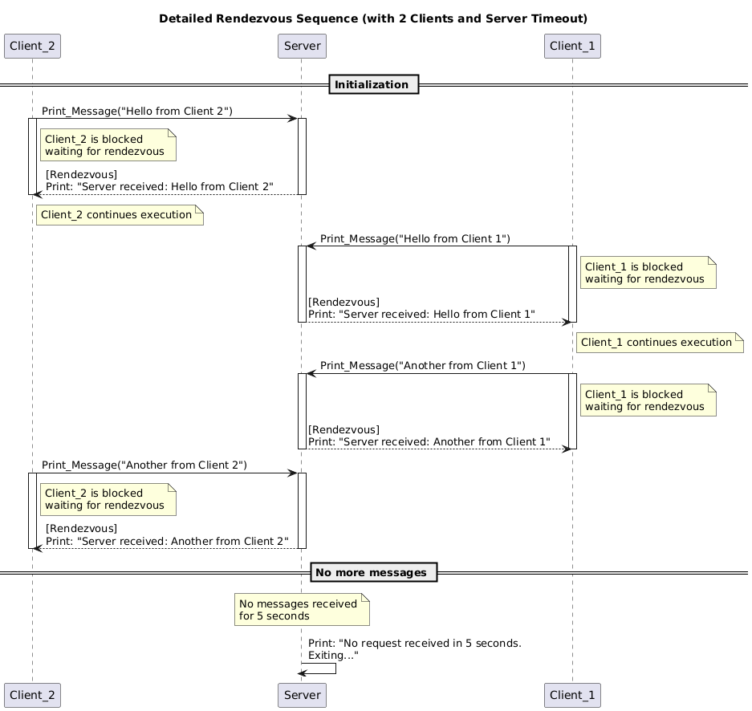

# Ada

## Introduction:
TODO

## Installing Alire:

This project uses [Alire](https://alire.ada.dev), the Ada package manager, to manage dependencies, compilation, and execution.

To get started, follow the official installation instructions here:  
👉 https://alire.ada.dev/docs/#getting-started

You can then verify the installation executing the following command:
```bash
    alr --version
```
If you see the version number, you are good to go!

## Using this repo:
After installing Alire, you can use this project by cloning this repo
```bash
    git clone https://github.com/danlivingston/Ada.git
```

After cloning this repository, run the following commands:

```bash
    cd Ada        # Enter the project folder    §
    alr build     # Builds the project and downloads dependencies
    alr run       # Runs the executable
```

# Topics of Ada presented of this Project:
##  1. In & Out Parameters:
In Ada, subprograms (procedures and functions) use explicit parameter modes to define how data is passed and used within a call. These modes are: in, out, and in out. This design choice is central to Ada's philosophy of safety, clarity, and correctness.

### in Parameters
These are read-only parameters. The caller provides a value, and the callee may use it but cannot modify it.

```ada
    procedure Display(Value : in Integer);
```

Attempting to write to Value in the procedure body would result in a compile-time error.

### out Parameters
These are write-only from the perspective of the callee. The caller does not expect any initial value, and the callee must assign a value before returning.

```ada
    procedure Compute(Result : out Integer);
```

Reading from Result before assigning a value is a compile-time error.

### in out Parameters
These are read-write. The caller passes a value that the callee can both read and modify.

```ada
    procedure Update(Counter : in out Integer);
```

This is suitable when the subprogram needs to modify and return a new version of a variable.

## Example:
A full example demonstrating all three parameter modes (in, out, and in out) can be found in:

```bash
    src/focus_points/inandoutexample.adb
```

This example defines a procedure that takes:
- an in parameter: a number that will be doubled,
- an in out parameter: a counter that tracks how many times the procedure has been called,
- an out parameter: a message string that describes the result of the operation.

When the procedure is called:
- The input number is read but not modified (ensured by in mode).
- The counter is incremented and retained across calls (thanks to in out mode).
- The message is assigned a new string and returned to the caller (out mode).

This example illustrates the clear separation of roles for each parameter — a principle that helps prevent unintended side effects and improves code readability and correctness.

## Comparasion with Java:
In Java, there is no way to explicitly declare if a parameter is used for input, output, or both.
All parameters are passed by value — but if you pass an object, Java copies the reference, so you can change the object’s content.

```java
    class Data {
        public int value;
    }

    void update(Data d) {
        d.value = 42; // modifies the original object
    }
```

This works because d refers to the same object.

But if you try the same with a primitive type like int:
```java
    void update(int x) {
        x = 42;
    }
```

Nothing changes outside the function — x is just a copy.

In summary:
- Java lets you modify objects, but not primitives.
- There’s no compiler check to ensure how parameters are used.
- In contrast, Ada forces you to be explicit (in, out, in out) — making data flow clear, safe, and verifiable.

## Useful Links:
- https://en.wikibooks.org/wiki/Ada_Programming/Subprograms
- https://learn.adacore.com/courses/Ada_For_The_CPP_Java_Developer/chapters/06_Functions_and_Procedures.html

##  2. In & Out Parameters:
In Ada, tasks are units of concurrent execution. The rendezvous mechanism allows tasks to communicate and synchronize by exchanging control and data in a safe and predictable way.

A rendezvous occurs when:
- A calling task invokes an entry of another task.
- The receiving task executes an accept statement for that entry.
- Both tasks wait for each other: the call and accept must happen at the same time.
- Once matched, the accept block executes and the tasks proceed.

This mechanism enforces safe synchronization between tasks, avoiding race conditions and ensuring clear communication patterns.

Core Features of Rendezvous
- Mutual Exclusion: only one task at a time can perform a rendezvous for a specific entry.
- Synchronization: both caller and callee block until they are both ready.
- Data Exchange: parameters can be passed to and from the entry during the rendezvous.
- Controlled Selection: with select, a task can choose between multiple possible rendezvous, handle timeouts, or terminate gracefully.

## Example:
A complete example of a server task interacting with two client tasks using rendezvous is provided in:

```bash
    src/focus_points/inandoutexample.adb
```

This example defines:
- A Server task with an entry Print_Message.
- Two concurrent tasks (Client_1 and Client_2) that call Print_Message at different times.
- A select block in the Server that handles:
  - Incoming messages via accept
  - A timeout using delay

The rendezvous happens at each call to Print_Message, where the client task is blocked until the server accepts the message. Once both are ready, the server prints the message and both tasks continue.

### Visual Explanation:
This sequence diagram shows how Client_1 and Client_2 interact with the Server task, when the rendezvous occurs, and how the Server exits after inactivity.

.

## Comparison with Java:
In Java, communication and synchronization between threads is typically done using:
- synchronized methods or blocks,
- shared variables with manual locking (ReentrantLock, volatile),
- low-level primitives like wait() and notify().

While powerful, these mechanisms are error-prone and require the programmer to manually ensure synchronization and mutual exclusion.

In contrast, Ada provides a built-in, safer mechanism: the rendezvous.

A rendezvous in Ada:
- synchronizes the caller and the callee automatically,
- ensures mutual exclusion (only one task at a time is accepted),
- allows structured data exchange via entry parameters,
- makes concurrency explicit and verifiable by the compiler.

#### Ada (safe, explicit rendezvous):

```ada
    -- Client task
    Server.Print_Message("Hello!");

    -- Server task
    accept Print_Message(Msg : String) do
        Put_Line(Msg);
    end;
```

#### Java (manual synchronization, less safe):

```java
    class Server {
        public synchronized void printMessage(String msg) {
            System.out.println(msg);
        }
    }

    // In a thread
    server.printMessage("Hello");
```

In Java:
- synchronized ensures mutual exclusion inside the method,
- but does not synchronize the client and server — the caller continues immediately,
- there’s no rendezvous, just a protected method.

To achieve similar synchronization, Java would require more complex constructs using wait() and notify(), which are harder to reason about and easier to misuse.

In summary:
- Ada forces you to structure concurrent communication safely and clearly.
- Java gives you flexibility, but puts the burden of correctness on the programmer.

## Useful Links:
https://learn.adacore.com/courses/Ada_For_The_CPP_Java_Developer/chapters/11_Concurrency.html