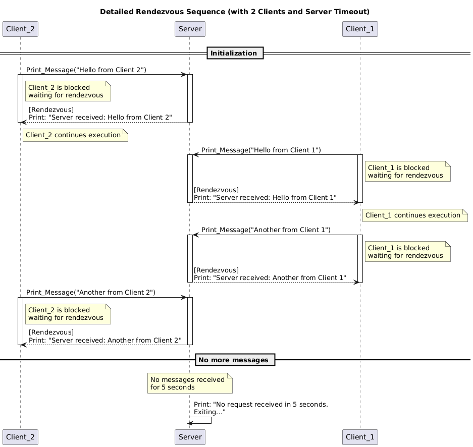

# Ada - PCP

> by Davide Ceresa & Dan Livingston

Repository: <https://github.com/danlivingston/Ada>

## Introduction

Ada is a statically typed, structured, and imperative high level programming language designed for reliability, safety, and maintainability. Originally developed in the early 1980s by the U.S. Department of Defense, Ada was created to unify and standardize the many programming languages used in defense systems. It is named after Ada Lovelace, who is often regarded as the first computer programmer.

Ada is known for its strong typing, modularity, and built-in support for real-time and embedded systems. It is widely used in mission-critical applications such as aerospace, transportation, and medical devices—where software failures can have serious consequences.

## Focus Topics

### 1. Declarative regions

#### What Is a Declarative Region?

A declarative region in Ada is a portion of code where declarations are allowed and visible. It begins after a declare keyword (or the start of a block/package/subprogram) and ends before the begin keyword. Declarative regions provide scope for identifiers and can be nested. They exist in procedures, functions, packages, tasks, blocks, loops, and records.

#### Why Use Declarative Regions?

- Encapsulation: Keep variables local to a subprogram or block.
- Clarity: Organize code and limit scope of identifiers.
- Memory Management: Objects declared in a declarative region are automatically cleaned up at the end.
- Modularity: Each region can be self-contained with its own declarations.

#### Example

A complete example demonstrating declarative regions in Ada and Java can be found in `src/focus_points/declarative_regions.adb` and `src/focus_points/DeclarativeRegions.java`.

##### Key Differences

- Scope Control: Ada uses explicit declarative regions; Java uses implicit block scoping.
- Variable Lifetime: Ada variables are cleaned up when the region ends; Java relies on garbage collection.
- Nesting: Ada allows nested procedures/functions; Java does not (only inner classes or lambdas).
- Modularity: Ada emphasizes modularity through packages and nested blocks; Java uses classes and packages.
- Clarity: Ada’s explicit structure improves code readability and scope management.

### 2. In & Out Parameters

In Ada, subprograms (procedures and functions) use explicit parameter modes to define how data is passed and used within a call.

#### in Parameters

These are read-only parameters. The caller provides a value, and the callee may use it but cannot modify it. Attempting to write to Value in the procedure body would result in a compile-time error.

#### out Parameters

These are write-only from the perspective of the callee. The caller does not expect any initial value, and the callee must assign a value before returning. Reading from Result before assigning a value is a compile-time error.

#### in out Parameters

These are read-write. The caller passes a value that the callee can both read and modify. This is suitable when the subprogram needs to modify and return a new version of a variable.

#### Example

A full example demonstrating all three parameter modes (in, out, and in out) can be found in `src/focus_points/in_and_out.adb` and `src/focus_points/InAndOut.java`.

### 3. Design by Contract

Design by Contract (DbC) is a methodology that defines formal, precise, and verifiable interface specifications for software components. It involves:

- Preconditions – What must be true before a subprogram executes.
- Postconditions – What must be true after a subprogram executes.
- Invariants – Conditions that must always be true during the life of an object.

Ada natively supports Design by Contract starting from Ada 2012, using aspect specifications like `Pre`, `Post`, and `Type_Invariant`.

#### Example

A complete example demonstrating Design by Contract in Ada and comparison to Java can be found in `src/focus_points/design_by_contract.adb` and `src/focus_points/DesignByContract.java`.

### 4. Rendezvous

In Ada, tasks are units of concurrent execution. The rendezvous mechanism allows tasks to communicate and synchronize by exchanging control and data in a safe and predictable way.

A rendezvous occurs when:

- A calling task invokes an entry of another task.
- The receiving task executes an accept statement for that entry.
- Both tasks wait for each other: the call and accept must happen at the same time.
- Once matched, the accept block executes and the tasks proceed.

This mechanism enforces safe synchronization between tasks, avoiding race conditions and ensuring clear communication patterns.

Core Features of Rendezvous

- Mutual Exclusion: only one task at a time can perform a rendezvous for a specific entry.
- Synchronization: both caller and callee block until they are both ready.
- Data Exchange: parameters can be passed to and from the entry during the rendezvous.
- Controlled Selection: with select, a task can choose between multiple possible rendezvous, handle timeouts, or terminate gracefully.

#### Example

A complete example of a server task interacting with two client tasks using rendezvous is provided in `src/focus_points/rendezvous.adb` and `src/focus_points/Rendezvous.java`.

The sequence diagram `diagrams/rendezvous_sequence_diagram.png` shows how `Client_1` and `Client_2` interact with the `Server` task, when the rendezvous occurs, and how the `Server` exits after inactivity.
<!-- This sequence diagram shows how `Client_1` and `Client_2` interact with the `Server` task, when the rendezvous occurs, and how the `Server` exits after inactivity.

 -->

### 5. Protected Objects and Types

In Ada, protected objects are used to manage shared data between multiple tasks safely and efficiently. They are similar to monitors or synchronized objects in other languages, but are built into the language and enforced by the compiler.

Protected objects combine:

- Mutual exclusion: Only one task can execute a protected operation at a time.
- Data encapsulation: State is stored inside the object and cannot be accessed directly.
- Optional synchronization: Using entry and when conditions.

#### Protected Types vs Protected Objects

- A protected type defines the interface and internal data (like a class).
- A protected object is an instance of a protected type (like an object).

#### Example

A complete example of protected types is provided in `src/focus_points/protected_objects_types.adb` and `src/focus_points/ProtectedObjectsTypes.java`

## Reflection

**Pros**

- Extremely Safe and Disciplined: Ada enforces strict typing and compile-time checks, reducing the likelihood of runtime errors.
- Built-in Features for Robustness: Features like Rendezvous and Design by Contract enhance reliability and safety in concurrent and critical systems.

**Cons**

- High Learning Curve: The unfamiliar syntax and strict structure make it challenging for newcomers.
- Weak Toolchain: IDE support and debugging tools are underdeveloped, making development less efficient.
- Not Suitable for Rapid Development: Ada is not ideal for quick prototyping or web development due to its complexity and slower iteration cycle.

**When to Use Ada?**

- Recommended: For projects where failure is not an option, such as safety-critical systems in aerospace, defense, or medical devices.
- Not Recommended: For fast-paced projects like web development or exploratory prototyping.

### Davide Ceresa

Working with Ada was a formative experience. At first, I struggled with its strict syntax, especially compared to more permissive languages like Java or Python. Even basic tasks like string handling felt unintuitive — I often had to rely on Unbounded_String for flexibility.

What stood out, however, was Ada’s built-in concurrency model. Once I understood tasks, rendezvous, and protected objects, I saw how powerful and well-integrated these features are. Unlike Java, which often needs external libraries, Ada offers a structured, native approach to concurrency.

The learning curve was steep. Ada isn’t widely used today, and finding examples or community support was often challenging. Documentation exists but can be hard to grasp without prior familiarity.

While I likely won’t use Ada in future projects, I now understand its role in safety-critical systems. Its emphasis on correctness and reliable concurrency makes it ideal where failure isn’t an option.

### Dan Livingston

Before the PCP module, I had never heard of Ada. Choosing it for our assignment was a leap, but its focus on safety and structure made it an interesting challenge.

Ada’s strictness — from strong typing to design by contract — forced us to be disciplined and deliberate in our coding. I can see why it’s used in critical systems like aerospace and defence.

However, working with Ada wasn’t smooth. Debugging was frustrating due to poor IDE support and inconsistent compiler behavior. We couldn’t easily test small code pieces or rely on breakpoints, so we built a small interactive tool to help us run demos.

With limited online resources and sparse community support, we often felt on our own. Despite the struggles, working with Ada taught me to value reliability and thoughtful design.
